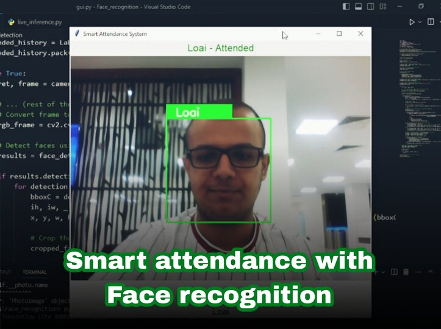

# Smart Attendance Project

  

 
<!-- Insert your project logo if available -->

Welcome to the Smart Attendance project! This project leverages computer vision techniques, specifically face recognition, to create a smart attendance system. The system employs a two-step approach: face detection using the MediaPipe library and face recognition using the Facenet model from the DeepFace library.

## Table of Contents

- [Introduction](#introduction)
- [Features](#features) 
- [Installation](#installation)
- [Usage](#usage)
- [Getting Started](#getting-started)
  - [Data Collection](#data-collection)
  - [Model Training](#model-training)
  - [Inference](#inference)
  - [Attendance with GUI](#attendance-with-gui)
- [Installation](#installation)
- [Usage](#usage)
- [Contributing](#contributing)
- [License](#license)

## Introduction

Modernizing attendance tracking, this project integrates AI and computer vision into the attendance process. By combining face detection and recognition, the system can accurately identify and log attendees, providing an efficient and convenient alternative to traditional methods.

## Features

- **Face Detection**: Utilizes the MediaPipe library to detect faces within frames or images.
- **Face Recognition**: Employs the Facenet model from the DeepFace library to recognize individuals based on facial features.
- **Data Collection**: Custom script for collecting training data, organized by individual faces in separate folders.
- **Training**: Training script that trains the Facenet model on the collected dataset.
- **Inference**: Inference script for real-time attendance tracking using the trained model.
- **Attendance with GUI**: Utilize the `attendance_gui.py` script to display live attendance tracking with a simple GUI.

## Installation

1. Clone this repository: `git clone https://github.com/LoaiMB/Smart_Attendance.git`
2. Navigate to the project directory: `cd Smart_Attendance`
3. Create new virtual environment: `python -m venv venv` (Windows) or `python3 -m venv venv` (Linux/macOS)
4. Activate the venv: `venv\Scripts\activate` (Windows) or `source venv/bin/activate` (Linux/macOS) 
5. Install the required dependencies: `pip install -r requirements.txt`

## Usage

1. Follow the steps in the [Data Collection](#data-collection) section to collect training data.
2. Run the [Model Training](#model-training) script to train the Facenet model.
3. Execute the [Inference](#inference) script to perform real-time attendance tracking.
4. To use the GUI attendance tracking, run the `attendance_gui.py` script.
5. When finshed make sure to deactivate the venv by typing `deactivate` in the command line
## Getting Started

### Data Collection

To start, run the `collect.py` script. This script employs the MediaPipe face detection model to identify faces in frames, which are then cropped and organized into separate folders per individual. This dataset will serve as the basis for training the face recognition model. Note: Remember to add your employee names to the list variable named "employee_names" in collect.py code. As a start, you can collect 5-10 images per person with a variety of angles and poses.

### Model Training

After data collection, proceed to the `training.py` script. This script utilizes the Facenet model provided by the DeepFace library to train on the collected dataset. The trained model will learn to extract and recognize facial features, forming the foundation for attendance tracking.

### Inference

The `inference.py` script is designed for real-time attendance tracking. It uses the trained Facenet model to recognize faces in live video streams or images, enabling efficient attendance management.

### Attendance with GUI

For a more interactive experience, the `attendance_gui.py` script provides a simple GUI to display real-time attendance tracking. The script utilizes the trained face recognition model to identify attendees and displays the results in a user-friendly interface.

## Contributing

Contributions are welcome! If you have ideas for improvements, new features, or bug fixes, feel free to submit a pull request. Please follow the established coding conventions and ensure that your contributions align with the project's goals.

## License

This project is licensed under the (LICENSE).

---

Feel free to adapt and expand upon this template to accurately represent your project. Ensure that you provide clear instructions, detailed explanations, and any additional information that users might find helpful. Good luck with your Face Smart Attendance project!

